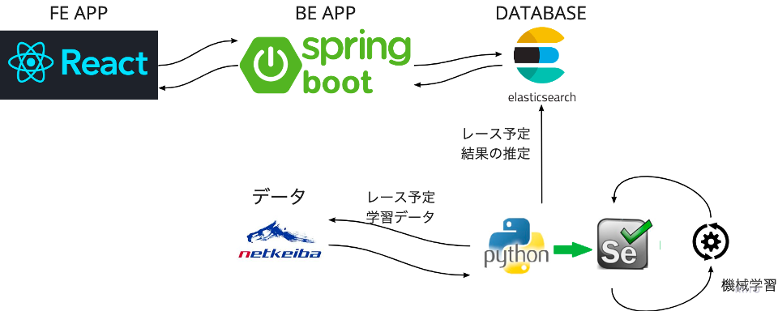

# keiba_document

## 構成

## 環境

* React
* Spring Boot
* Python

## データ対象

[net-keiba][3]

## 成果物

[GitHub-BackEnd][1]

[GitHub-ML][2]

[1]:https://github.com/is0363hr/keiba_back_end
[2]:https://github.com/is0363hr/keiba_ml
[3]:https://db.netkeiba.com/?pid=race_search_detail